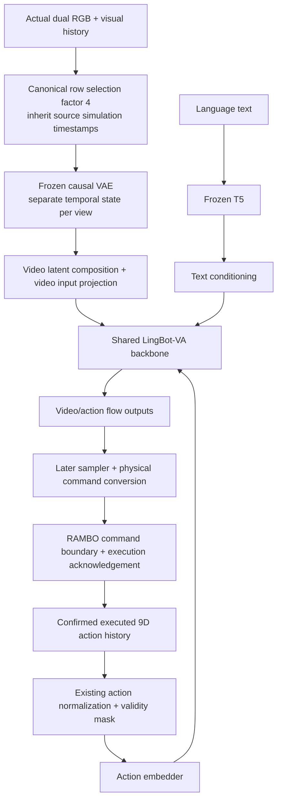

# v2 ownership and runtime

This is the simulator repository in the quadruped native 9D adaptation baseline.
WAM-Policy owns model conversion, model readers/preprocessing/cache, normalization, SFT, inference and model evaluation.
RAMBO_Data owns Isaac/RAMBO, task assets and cameras, teleoperation, recording, telemetry, success detection and canonical dataset publishing.
The repositories exchange explicit data and runtime contracts; neither imports the other's implementation.

## Current implementation boundary
Stages 0–1 establish branches, directory identity, governance, packaging and quadruped cleanup.
Stage 3 implements canonical v2 schemas/profiles, offline validation and a pure synchronous command protocol.
DATA-004 validates real camera/control/recorder integration for one technical pilot. Target-pair contact remains unknown diagnostic evidence; production dataset release is not validated.
Existing Go2/D435i nominal camera geometry is retained as a runtime reference, not a device calibration or production dataset acceptance.

## Compute
Local Ubuntu 24.04 / RTX 5070 Ti: development, debugging, Isaac data synthesis and feasible model/evaluation checks.
The user authorizes outside-sandbox execution for necessary local GPU work. Sandbox device visibility does not diagnose host drivers.
Full SFT will run on the remote AMD server previously used for native LingBot-VA OPD, after local debugging and job-script preparation.
Remote hardware/backend, connection and job configuration remain unverified; OPD is not part of this baseline.

## Resources
Use workspace.env and workspace.lock.yaml for installed runtime paths. Keep immutable data/model/checkpoint and historical manifests in workspace layers.
Source directory migration is recorded in new evidence; historical absolute paths are not rewritten.

## Stage 0–1 acceptance
Completed: branch/directory bootstrap, editable-source isolation, governance and quadruped cleanup.
The retained controller passed a 64-step native PhysX check. The nominal mounted pair passed a 240-step RTX check with 30 frames per view.
No production dataset, model conversion, training or new task is claimed by these checks.
Full records are under workspace runs/audit/v2/V2-BOOTSTRAP/20260915T024558Z.

## Stage 3 acceptance
[Contract interfaces](contracts-v2.md) passed CPU and two-interpreter conformance checks.
Evidence: workspace `runs/audit/v2/V2-CONTRACTS/20260915T060642Z`. That DATA-001 attempt did not run real wiring or dataset release; DATA-004 now validates the collector path.

## Current dataset revision

DATA-002 supersedes the old PNG/direct12.5Hz data clauses with LeRobot v2.1-style50Hz raw/canonical video/action rows, terminal snapshots and separate model cache. See [current interface](contracts-v2.md). Model RGB remains12.5Hz. DATA-004 validates50Hz acquisition and25Hz observer for one technical pilot. Existing DATA-001 CPU results remain evidence only for the old data profile and retained pure protocol.

## First-task approval boundary — DATA-003

Approach-and-Push Box / Box 05 is **approved under DATA-004** with fixed camera coverage and geometry. Success requires the entire XY footprint inside the goal and robot not fallen for 3 consecutive50Hz policy ticks. Contact remains diagnostic/unknown. Prior DATA-003 candidate status is historical.

## System input paths

The diagram describes existing architecture and planned runtime connections. Flow outputs are not directly executable physical commands. Actual RGB enters the VAE path; text enters T5; only confirmed executed history enters the action path. Telemetry and observer remain outside model inputs. Learned-model sampler/server wiring remains not_run; the real collector/Isaac path is validated by DATA-004.

## Current DATA-004 valid replacement pilot

The prior 8.04s/402-action center-only pilot is invalid for current DATA-004 and excluded from future training. No legacy/compatibility path or history rewrite was introduced. The only current valid technical pilot is the new straight-push replacement under task profile `push-box-v2-2`.

The reviewed narrow `local_x_min` face is allowed. Actual mesh bounds define its center/normal and all corners. Box dimensions are about30.0763x17.4538x22.6464cm. Nominal geometric center is(0.690382,0.142000,0.133114)m, face center(0.540000,0.142000,0.133114)m and normal(-1,0,0), yaw0. Robot stays at native reset XY origin; FL's neutral lateral command aligns the push line. No yaw randomization, controller replacement or model architecture change.

The scripted expert approaches until the measured face distance is suitable, then approaches normally and advances the body with about0.38m FL forward reference. World-axis references are transformed into the existing projected-com native9 frame. This is demonstration generation using simulator state, not a learned-policy result. Intended face/commanded contact/actual FL EEF/box pose/yaw are recorded in audit-only task-review metadata.

Success requires the entire projected source-box bounding volume inside goal x=[0.95,1.35], y=[-0.10,0.40]m and robot not fallen for3 consecutive50Hz policy ticks. Four XY envelope corners are computed from all8 pose-transformed3D corners, including roll/pitch. Contact remains diagnostic/unknown and never gates success; yaw is reported without a success threshold.

The valid pilot lasts9.08s with454 completed actions. Full containment first appears at physics timestamp9036000000ns and policy timestamp9040000000ns; success ticks are9.04/9.06/9.08s. Terminal footprint X=[0.956747,1.297620],Y=[0.038445,0.257470]m is fully inside. Forward displacement0.436802m, net lateral displacement0.005958m. Yaw range[-12.405,1.875]degrees, final-7.396degrees; residual rotation is disclosed.

Real terminal-before-reset/reset isolation passed on the current implementation and final pilot. Raw/canonical validation and MP4 decode passed:455 dual50Hz Raw boundaries,454 canonical rows/frames plus separate terminal state/RGB,908 controller steps,4540 physics steps/4541 snapshots,909 actual sensor updates,228 observer25Hz frames. Requested/executed native9 and zero desired force/external wrench retained. Observer is never a model input or success ground truth. DATA-002 schema/profile bytes are unchanged.

WAM reads113 sampled RGB frames per view with inherited source timestamps, encodes real frozen VAE/T5, and reloads latents[1,48,29,24,20], actions/mask[1,9,29,16,1], text[1,512,4096]. Initial mask is false.448 actions enter complete groups;6 tail actions and their timestamps remain in Raw/canonical and are explicitly reported by cache metadata. Normalizer is diagnostic identity, not training statistics.

Evidence: workspace `runs/audit/v2/DATA-004/straight-push-20260916T042259Z`. Two failed development collection attempts are excluded (spawn XY/controller reference mismatch; expert overreach and lateral deflection). Only the replacement is the current valid pilot. WAM73 and RAMBO220 CPU tests passed; real data/model gates were executed separately. The user accepted this replacement pilot and authorized DATA-004 commit/push. Further batch demonstrations require separate authorization; formal training/release and model server closed-loop remain not_run.
