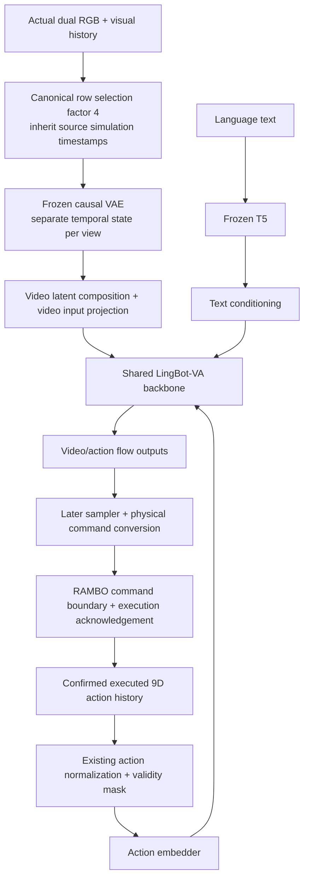

# v2 ownership and runtime

This is the simulator repository in the quadruped native 9D adaptation baseline.
WAM-Policy owns model conversion, model readers/preprocessing/cache, normalization, SFT, inference and model evaluation.
RAMBO_Data owns Isaac/RAMBO, task assets and cameras, teleoperation, recording, telemetry, success detection and canonical dataset publishing.
The repositories exchange explicit data and runtime contracts; neither imports the other's implementation.

## Current implementation boundary
Stages 0–1 establish branches, directory identity, governance, packaging and quadruped cleanup.
Stage 3 implements canonical v2 schemas/profiles, offline validation and a pure synchronous command protocol.
Actual camera/contact/control integration and production dataset release are not yet validated.
Existing Go2/D435i nominal camera geometry is retained as a runtime reference, not a device calibration or production dataset acceptance.

## Compute
Local Ubuntu 24.04 / RTX 5070 Ti: development, debugging, Isaac data synthesis and feasible model/evaluation checks.
The user authorizes outside-sandbox execution for necessary local GPU work. Sandbox device visibility does not diagnose host drivers.
Full SFT will run on the remote AMD server previously used for native LingBot-VA OPD, after local debugging and job-script preparation.
Remote hardware/backend, connection and job configuration remain unverified; OPD is not part of this baseline.

## Resources
Use workspace.env and workspace.lock.yaml for installed runtime paths. Keep immutable data/model/checkpoint and historical manifests in workspace layers.
Source directory migration is recorded in new evidence; historical absolute paths are not rewritten.

## Stage 0–1 acceptance
Completed: branch/directory bootstrap, editable-source isolation, governance and quadruped cleanup.
The retained controller passed a 64-step native PhysX check. The nominal mounted pair passed a 240-step RTX check with 30 frames per view.
No production dataset, model conversion, training or new task is claimed by these checks.
Full records are under workspace runs/audit/v2/V2-BOOTSTRAP/20260915T024558Z.

## Stage 3 acceptance
[Contract interfaces](contracts-v2.md) passed CPU and two-interpreter conformance checks.
Evidence: workspace `runs/audit/v2/V2-CONTRACTS/20260915T060642Z`. Real simulator/server wiring and dataset release remain not_run.

## Current dataset revision

DATA-002 supersedes the old PNG/direct12.5Hz data clauses with LeRobot v2.1-style50Hz raw/canonical video/action rows, terminal snapshots and separate model cache. See [current interface](contracts-v2.md). Model RGB remains12.5Hz. New50Hz acquisition and25Hz observer are specification targets, not runtime acceptance. Existing DATA-001 CPU results remain evidence only for the old data profile and retained pure protocol.

## First-task approval boundary — DATA-003

Approach-and-Push Box is a **proposed first-task candidate / pending user approval**. Assets, camera coverage, task geometry and success/contact criteria require user approval before the task is frozen. No first task is approved yet.

## System input paths

The diagram describes existing architecture and planned runtime connections. Flow outputs are not directly executable physical commands. Actual RGB enters the VAE path; text enters T5; only confirmed executed history enters the action path. Telemetry and observer remain outside model inputs. Real sampler/server/Isaac wiring remains not_run.
