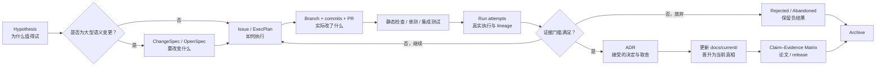

# ML / DL 研究项目文档与 Agent 上下文管理方案

版本：1.1
日期：2026-08-13
适用范围：算法研究、论文复现、模型训练、数据工程、消融实验、长期迭代型 ML / DL 仓库

使用方式：将本文件和配套模板放入项目仓库，交由仓库 Agent 作为文档治理与上下文维护协议执行；项目特有事实应写入该仓库自己的 `docs/current/`、ADR、ChangeSpec、ExecPlan 和 W&B 记录，不应反向写入本通用协议。

## 结论

最稳妥的方案不是寻找一个“万能文档”或一个“全自动 Agent 框架”，而是建立一个分层的 **Research Documentation & Context Stack**：

1. `AGENTS.md` 和文档索引负责最小、稳定、始终加载的上下文；
2. `docs/current/` 只描述当前被接受的算法、数据、训练与评估语义；
3. Hypothesis / ChangeSpec / ExecPlan 分别描述“为什么试”“准备改变什么”“具体怎样做”；
4. ADR 记录已经做出的重要决策及取舍；
5. Git / PR 记录实际代码变更；
6. W&B 统一记录 Runs、指标、配置、媒体和 Artifact lineage；受限数据或模型使用 W&B Artifact metadata、不可变 URI 与内容哈希；
7. Claim–Evidence Matrix 把论文或报告中的结论绑定到代码、实验和产物；
8. 聊天、handoff 和 Agent memory 只用于辅助恢复，不作为权威事实。

一句话概括：

> **一个问题，一个权威来源；一个变更，一个 Work ID；一个实验尝试，一个 Attempt ID；任何“当前真相”都必须经过证据门槛后才能晋升。**

这套组合吸收了图中现有方案的长处，但重新划清了边界：`AGENTS.md` 管稳定规则，ExecPlan 管执行状态，ADR 管决策历史，Git / PR 管代码事实，W&B 管实验与 Artifact 事实，OpenSpec 只在大型语义变更中管正式规格。

---

## 1. 为什么长期 ML / DL 项目容易失去上下文

这类项目同时存在多种“真相”，而且它们的变化速度不同：

- 数学设计可能一个月才改变一次；
- 当前任务的进度可能每小时改变；
- 代码每个 commit 都会改变；
- 实验指标随每次运行改变；
- 数据版本、checkpoint 和运行环境可能在仓库外改变；
- Agent 的对话上下文随会话结束而消失；
- 论文文字常常落后于代码，或者先于代码提出尚未验证的主张。

把这些内容都塞进一个 `CURRENT_CONTEXT.md`、`TASK_LOG.md` 或超长设计文档，会产生四个典型问题：

1. **权威冲突**：同一事实在多个文件中有不同版本；
2. **时间污染**：计划、已实现、已验证、已废弃的内容混在一起；
3. **上下文过载**：Agent 每次都读取大量与当前任务无关的历史；
4. **不可审计**：无法回答“这个结论来自哪次运行、哪个 commit、哪个数据和哪个 checkpoint”。

因此，设计目标不是“文档越多越好”，而是：

- 可定位：Agent 能快速找到当前任务真正需要的资料；
- 可区分：设计、计划、实现和证据不会互相冒充；
- 可追溯：结论能反查到代码、配置、数据与实验；
- 可恢复：新会话只靠仓库和外部实验记录即可继续工作；
- 可维护：Agent 能自动更新低风险状态，人只审核高语义决策；
- 可扩展：同一协议适用于不同模型、数据形态、训练环境与研究阶段。

## 2. 先建立“权威来源地图”

不要宣称整个项目只有一个 Source of Truth。更准确的做法是：**每类问题只有一个权威来源**。

| 问题 | 权威来源 | 不应作为权威来源 |
|---|---|---|
| Agent 每次都必须遵守什么？ | `AGENTS.md` | 聊天记录、旧 handoff |
| 当前算法、张量契约和训练语义是什么？ | `docs/current/` | 变更提案、旧设计稿 |
| 为什么接受这个架构或算法决定？ | `docs/decisions/ADR-*.md` | commit message、口头讨论 |
| 准备改变什么行为？ | `docs/changes/active/<WORK-ID>/` 或 OpenSpec change | ExecPlan |
| 当前任务做到哪里、下一步做什么？ | `docs/work/active/<WORK-ID>/plan.md` | 全局 `TASK_LOG.md` |
| 实际改了哪些代码？ | Git commit / PR | 设计文档 |
| 实际运行了什么并观测到什么？ | W&B Run + run manifest | README 中手填的 loss |
| 使用了哪版数据、模型和 checkpoint？ | W&B Artifact lineage；受限 payload 使用不可变 URI + hash | 本机绝对路径 |
| 论文主张由什么证据支持？ | `docs/research/claims/` | 仅凭最新一次训练曲线 |
| 过去某个 Agent 说过什么？ | 聊天 / handoff / memory，仅供检索 | 当前事实 |

当来源冲突时，Agent 不应自行“取看起来更新的那个”，而应按权威来源地图报告冲突，再由证据或审核完成晋升。

## 3. 九层文档与上下文栈

| 层 | 解决的问题 | 主要载体 | 生命周期 | Agent 默认行为 |
|---|---|---|---|---|
| L0 路由层 | 去哪里找、必须遵守什么 | `AGENTS.md`、`docs/INDEX.md`、repo skills | 稳定 | 每次读取 |
| L1 当前真相层 | 当前算法、数据、训练、评估定义 | `docs/current/` | 低频变化 | 任务相关时读取；需证据才更新 |
| L2 研究意图层 | 假设、文献依据、待验证主张 | `docs/research/` | 中频变化 | 可新增，不能伪装成结论 |
| L3 变更规格层 | 准备改变哪些可观察行为 | ChangeSpec / OpenSpec | 每个大型变更 | 大型变更创建；完成后归档 |
| L4 执行层 | 怎么做、做到哪、发现了什么 | ExecPlan | 高频变化 | 自动维护进度和发现 |
| L5 决策层 | 最终为何选择某方案 | ADR / MADR | 追加式 | 接受、废弃或 supersede，不重写历史 |
| L6 实现层 | 实际代码差异及审核 | Git / PR | 每次变更 | commit / PR 绑定 Work ID |
| L7 证据层 | 运行、数据、模型、指标 lineage | W&B Runs、Artifacts、Reports、manifest | 每次尝试 | 自动采集，不靠手工回忆 |
| L8 发布层 | 论文、报告、release 的证据闭环 | Claim–Evidence Matrix、release dossier | 里程碑 | 仅引用满足门槛的证据 |

### 渐进式上下文加载

Agent 不应一上来读取整个仓库的所有文档。推荐四级加载：

1. **启动上下文**：根 `AGENTS.md` + 距离当前目录最近的嵌套 `AGENTS.md`；
2. **路由上下文**：`docs/INDEX.md`，根据任务类型找到权威文档；
3. **任务上下文**：当前 ChangeSpec、ExecPlan、直接相关 ADR 和 `docs/current/` 页面；
4. **证据上下文**：只在需要时读取代码、测试、run、artifact 和历史记录。

建议把“始终加载”的内容控制在约 5–10 KB，把动态历史留在按需加载的文件中。Codex 官方也建议让 `AGENTS.md` 保持短小、稳定，并说明其从仓库根目录到工作目录逐级合并、越近的文件优先；默认合并大小存在上限。

## 4. 从研究想法到当前真相的完整生命周期



### 4.1 统一 Work ID

每个可追踪变更只使用一个 ID，贯穿所有系统：

- `ALG-014`：算法或损失；
- `DATA-006`：数据或预处理；
- `EVAL-009`：评估协议；
- `INFRA-004`：运行环境或分布式；
- `DOC-003`：纯文档治理。

例如 `ALG-014` 同时出现在：

- `docs/research/hypotheses/HYP-ALG-014.md`；
- `docs/changes/active/ALG-014/`；
- `docs/work/active/ALG-014/plan.md`；
- 分支 `research/ALG-014-causal-rollout`；
- commit 和 PR 标题；
- W&B group / tags；
- `ADR-0012` 的 related work；
- 论文 claim 的 evidence links。

### 4.2 按风险决定文档重量

| 等级 | 适用情况 | 最小要求 |
|---|---|---|
| R0 | 只读解释、一次性诊断 | 不修改持久文档；回答中说明证据边界 |
| R1 | 小型、低风险、单会话修复 | Issue / PR + tests；通常不建 ADR / ChangeSpec |
| R2 | 多文件、多会话、可恢复执行 | ExecPlan + PR +验证记录 |
| R3 | 算法语义、数据 schema、checkpoint 契约、评估口径或论文主张变化 | Hypothesis + ChangeSpec + ExecPlan + runs；接受后 ADR + current docs |

这能避免“每改一行都写五份文档”，也避免大型算法重构只靠聊天上下文推进。

### 4.3 晋升规则

- Hypothesis 是待检验想法，不是事实；
- ChangeSpec 是批准实施的目标，不代表已经实现；
- ExecPlan 的 `completed` 只代表计划工作完成，不代表算法有效；
- PR merge 只证明代码进入分支，不证明真实训练成功；
- run `finished` 只证明进程结束，不自动证明结果有效；
- 只有满足预先写明的证据门槛，才能把决定标为 `accepted` 并更新 `docs/current/`；
- 被否定的假设和失败实验保留并归档，防止后续 Agent 重复踩坑。

## 5. 推荐目录结构

```text
repo/
├── AGENTS.md
├── .agents/
│   └── skills/                       # 可复用过程，不存动态项目状态
├── .agent/
│   └── PLANS.md                      # ExecPlan 规则；由 AGENTS.md 引用
├── docs/
│   ├── INDEX.md                      # 权威来源、状态、读取触发器
│   ├── current/                      # 仅当前被接受的语义
│   │   ├── overview.md
│   │   ├── algorithms/
│   │   ├── data/
│   │   ├── training/
│   │   ├── evaluation/
│   │   └── reproducibility/
│   ├── research/
│   │   ├── hypotheses/
│   │   ├── literature/
│   │   └── claims/                   # claim → evidence → confidence
│   ├── decisions/                    # ADR-0001-*.md
│   ├── changes/
│   │   ├── active/<WORK-ID>/         # 或使用 openspec/changes/
│   │   └── archive/
│   ├── work/
│   │   ├── INDEX.md                  # 建议自动生成
│   │   ├── active/<WORK-ID>/plan.md
│   │   └── archive/
│   └── releases/<VERSION>/           # 代码、模型、数据、指标证据包
├── experiments/
│   ├── manifests/                    # 每个 attempt 的不可变 manifest
│   └── analyses/                     # notebook / 报告，注明输入 runs
├── configs/                          # 可版本化配置
├── scripts/                          # 训练、评估、lineage 捕获与 docs lint
├── tests/
└── .github/
    └── pull_request_template.md
```

如果采用 OpenSpec，使用其原生 `openspec/specs/` 与 `openspec/changes/`，不要再平行维护一套内容相同的 `docs/changes/`。建议分工：

- `openspec/specs/`：可测试、可观察的当前行为；
- `openspec/changes/`：提议的行为增删改；
- `docs/current/algorithms/`：数学推导、张量形状、模型语义和研究解释；
- ExecPlan：实施路径、进度、发现和验证；
- ADR：最终选择及其后果。

## 6. 每类文档的职责与写法

### 6.1 `AGENTS.md`：稳定规则与路由器

适合放：

- 项目目标和当前维护范围；
- 权威文档位置；
- 不变量和安全边界；
- 环境、测试和常用命令；
- 何时必须创建 ExecPlan / ChangeSpec / ADR；
- 子目录的职责和对应 skill；
- 禁止事项，例如不得把 smoke test 描述成真实 GPU 训练验证。

不适合放：

- 今天完成了什么；
- 某次 run 的实时 loss；
- 大段设计历史；
- 当前 blockers；
- 单个任务的下一步；
- 对聊天记忆的依赖。

根级规则见 [`AGENTS.md`](../../AGENTS.md)。大型仓库可在 `data/`、`training/`、`evaluation/` 等目录添加更近的 `AGENTS.md`，只写该子树特有规则。

### 6.2 `docs/INDEX.md`：人和 Agent 的导航控制面

建议每个条目至少包含：

| 字段 | 作用 |
|---|---|
| `path` | 文件位置 |
| `type` | current / ADR / plan / change / evidence / archive |
| `status` | accepted / active / proposed / historical / superseded |
| `authority_scope` | 它对哪类问题有权威性 |
| `read_when` | 什么任务才需要读取 |
| `as_of_commit` | 最后核对的 commit |
| `owner` | 负责维护的人或角色 |

索引应由脚本尽量自动生成或校验。不要靠 Agent 手工同时维护多份索引。

### 6.3 `docs/current/`：只保留已接受的当前语义

每页应有结构化头信息：

```yaml
---
id: CUR-ALG-INFERENCE
type: current-design
status: accepted
authority_scope: inference-semantics
as_of_commit: <full-git-sha>
last_verified_at: 2026-08-13
supersedes: []
related_adrs: [ADR-0012]
source_map:
  - src/model/inference.py::InferencePipeline.run
  - tests/test_inference.py::test_inference_contract
evidence:
  static_source: passed
  unit_synthetic: passed
  real_artifact: not_run
  target_hardware: not_run
  benchmark_ablation: not_required
  multi_seed_statistics: not_required
---
```

正文写“现在是什么”，历史原因链接到 ADR，未来设想链接到 ChangeSpec。`as_of_commit` 不意味着整页会自动正确；它表明最后一次人工或受控校验的边界。

### 6.4 Hypothesis：把研究问题和成功标准写在实现之前

最小内容：

- 问题与动机；
- 可证伪假设；
- 主要指标和护栏指标；
- 失败判据；
- 计算预算；
- 可能混杂因素；
- 预注册的解释边界。

如果工作要支持比较性性能主张，再增加 baseline、benchmark/ablation 和相应公平预算；如果要支持稳健统计主张，再增加 multi-seed 设计。两者默认都是可选项，不是每个 Hypothesis 的必需门槛。

例如：“在指定数据和预算下，新训练目标使主要指标达到预定阈值，同时护栏不下降超过容许范围”是可检验假设；“新目标更合理”则不够精确。

### 6.5 ChangeSpec / OpenSpec：描述“什么行为必须改变”

大型变更规格应写：

- 当前问题与范围；
- proposed behavior；
- 明确不在范围内的内容；
- 新增、修改、移除的行为；
- 接口、张量、数据、checkpoint 和兼容性影响；
- 可观察的验收场景；
- 迁移和回滚策略；
- 未决问题。

它不应包含逐日进度。OpenSpec 的价值在于把 current specs 与 proposed changes 分离，并在归档时将 delta 合并进当前规格；小修复则不需要为此增加形式负担。

模板见 [`templates/change-spec.md`](../templates/change-spec.md)。

### 6.6 ExecPlan：可由新会话独立续跑的活文档

一个合格的 ExecPlan 必须让完全没有聊天记录的新 Agent 只依靠：

1. 当前工作树；
2. ChangeSpec / current docs；
3. 这份 plan；

就能安全继续执行。

至少维护：

- Purpose / Big Picture；
- Scope / Non-goals；
- Context and Orientation；
- Milestones；
- `Progress`，带时间戳和复选框；
- `Surprises & Discoveries`，附证据；
- `Decision Log`；
- Validation Plan，明确证据层级；
- Idempotence / Recovery；
- Outcomes & Retrospective。

不要再让所有 Agent 共同修改一个不断增长的 `TASK_LOG.md`。一项工作一个 plan，可以降低并发冲突，也让归档自然发生。模板见 [`templates/exec-plan.md`](../templates/exec-plan.md)。

### 6.7 ADR / MADR：记录“接受了什么以及为什么”

ADR 适合记录：

- 数据关系类型和 schema；
- 核心训练或推理语义；
- checkpoint 是否向前兼容；
- 主要评估口径；
- 训练并行策略。

不适合记录：

- 临时调试决定；
- 尚未验证的构想；
- 单次 run 的超参数；
- 可以直接从代码看出的微小实现细节。

ADR 应采用追加和 supersede，而不是回头改写过去。模板见 [`templates/adr.md`](../templates/adr.md)。

### 6.8 Git / PR：实现事实与审查门

建议约定：

- 分支名包含 Work ID；
- commit / PR 标题包含 Work ID；
- PR 说明必须链接 ChangeSpec、ExecPlan、ADR、runs；
- PR 明确算法、数据、checkpoint、评估与可复现性影响；
- 受保护分支要求 docs lint、测试和 lineage 检查；
- 合并不等于算法已被证实，`docs/current/` 的晋升可以晚于代码 merge。

模板见 [`templates/pull-request.md`](../templates/pull-request.md)。

### 6.9 实验、数据和模型 lineage

#### 统一使用 W&B

本协议固定选择 W&B 作为唯一主实验系统，不再维护平行实验系统：

- W&B Runs 记录每次实际启动、配置、指标、系统信息和媒体；
- W&B Groups / tags 绑定 Work ID、logical run 和 attempt；
- W&B Artifacts 记录数据 manifest、resolved config、checkpoint 元数据、评估产物及其 lineage；
- W&B Reports 用于阶段性诊断和可复核展示；
- 数据或 checkpoint 不允许上传时，Artifact 只记录不可变 URI、SHA-256、访问级别和元数据，不上传受限 payload。

仓库中的 run manifest 是可版本化的运行身份清单，W&B 是实际运行事实，两者通过 Work ID、Attempt ID、W&B Run ID 和 artifact hash 对齐。不要把同一指标和 lineage 手工复制到另一套实验系统。

#### Logical Run 与 Attempt 必须分开

- `logical_run_id`：一个实验意图，例如同一配置的长训练；
- `attempt_id`：一次实际启动、Slurm job、恢复或重提；
- `wandb_run_id`：该 attempt 对应的 W&B Run ID；
- `parent_attempt_id`：如果从上一次恢复，显式记录父尝试；
- `resume_from_checkpoint`：恢复点的 URI 和 hash。

推荐“一次实际启动一个 W&B run”，用 group / parent 字段把它们组成一个 logical run。若平台限制必须复用同一 W&B run，至少要写不可变的 attempt manifest 和明确的 revision/step boundary，不能让两个提交版本在曲线上无痕拼接。

每次 attempt 至少记录：

- full Git SHA、branch、dirty flag、dirty patch hash；
- entrypoint、完整命令、解析后的配置和配置 hash；
- 数据集、split、预处理版本和 manifest hash；
- teacher / student / resume checkpoint 的 URI 与 hash；
- seed；
- Python、框架、CUDA / ROCm、容器或 lockfile；
- 主机、GPU 数、调度器 job ID；
- 输入 / 输出 artifact；
- 开始、结束、状态和 exit reason；
- Work ID、PR、plan、ADR 和 evidence 链接。

模板见 [`templates/run-manifest.yaml`](../templates/run-manifest.yaml)。

### 6.10 Claim–Evidence Matrix：从实验到论文

推荐为每个论文主张维护：

| Claim ID | 主张 | 指标 / 数据 | Runs | Commit | Artifact | 统计方法 | 状态 |
|---|---|---|---|---|---|---|---|
| CLM-007 | 方法 A 在任务 X 达到预定指标 | success rate | run-… | SHA | eval-… | 与该 claim 匹配的方法 | supported |

状态可使用 `proposed / partial / supported / contradicted / retracted`。只有比较性或稳健性 claim 才要求相应 benchmark/ablation 或 multi-seed 证据；它们在一般工程验收中默认可选。这样论文文字不会把“代码已实现”误写成“实验已证明”。

## 7. 证据不是单一的“通过 / 未通过”

ML / DL 项目应按验证层级分别记录：

```yaml
evidence:
  source_review: passed
  static_checks: passed
  unit_synthetic: passed
  integration_small: passed
  real_artifact: pending
  target_hardware: pending
  short_training: pending
  benchmark_ablation: not_required
  multi_seed_statistics: not_required
```

`benchmark_ablation` 和 `multi_seed_statistics` 默认状态为 `not_required`。只有 ChangeSpec 因比较性性能主张、论文 claim、审稿要求或用户明确要求而将其标为 required 时，它们才会阻止晋升。Agent 不得擅自把可选门升级为必需门，也不得在未执行时作出相应性能或稳健性主张。

典型边界：

- import 成功不证明训练语义正确；
- CPU smoke test 不证明 AMD / CUDA 集群可运行；
- synthetic tensor test 不证明真实 checkpoint 兼容；
- 单次短跑不证明收敛；
- loss 变小不证明目标指标提高；
- PR merged 不证明论文 claim 成立。

Agent 在总结时必须把“已验证、尚未验证、无法验证”分开写，不能用一个模糊的 `validated: true` 覆盖所有层级。

## 8. Agent 自动维护协议

### 8.1 会话开始

Agent 应按顺序：

1. 读取适用的 `AGENTS.md`；
2. 读取 `docs/INDEX.md`；
3. 确认当前 branch、HEAD、工作树和用户授权范围；
4. 根据 Work ID 找到 active ChangeSpec / ExecPlan；
5. 只读取相关 current docs、ADR、代码和 runs；
6. 若来源冲突，先报告，不静默合并。

### 8.2 执行中

Agent 可以自动：

- 更新 plan 的 `Progress`；
- 记录带证据的 discoveries；
- 记录已做出的局部执行决定；
- 生成索引、路径映射和运行 manifest；
- 把测试输出、run URL、artifact hash 绑定到 Work ID；
- 归档已完成的 plan，但应保留历史。

Agent 应要求审核或明确授权后再：

- 把 ADR 改为 `accepted`；
- 把 proposal 晋升到 `docs/current/`；
- 修改论文核心 claim；
- 改变数据迁移、checkpoint 复用或兼容策略；
- 删除历史证据或重写失败结论。

### 8.3 会话结束

一个可恢复的 handoff 不是另写一篇长叙事，而是保证：

- plan 的 Progress、Discoveries、Decision Log 和下一步已更新；
- 工作树状态和最后 commit 清楚；
- 运行中任务有 Attempt ID、scheduler ID 和 W&B Run URL；
- 未决问题列出需要谁决定；
- 证据边界明确；
- `docs/work/INDEX.md` 可定位这项工作。

聊天总结只需链接这些持久载体，不再复制全部内容。

## 9. 自动化与 CI

建议建立一个 `docs-check`，至少验证：

1. frontmatter schema、ID 与 status 合法；
2. Work ID 在 change、plan、PR 和 run 中能相互解析；
3. `docs/work/active/` 中没有 `completed` 或 `abandoned` plan；
4. `docs/current/` 不链接被标记为 historical / superseded 的“当前计划”；
5. `as_of_commit` 存在且 source map 中的路径 / 符号存在；
6. 文档内部链接有效；
7. `AGENTS.md` 未超过团队设定的软上限；
8. 文档不包含 secret、本机私有绝对路径或不可分享 token；
9. run manifest 包含 full SHA、配置 hash、数据 / checkpoint 身份；
10. PR 触及算法、数据、checkpoint 或评估契约时，必须勾选相应文档影响；
11. 默认分支启用必要状态检查和 review 规则。

可自动生成但不应自动“创造事实”的内容：

- 当前 active work 索引；
- source map 中路径是否仍存在；
- repository tree 摘要；
- run / artifact 链接列表；
- 文档 stale 提醒；
- release evidence dossier 的机械部分。

不建议让定时 Agent 无审核地重写 `docs/current/` 或批量接受 ADR。自动化适合发现漂移，不适合替研究者做语义判断。

## 10. 不同类型项目如何实例化

协议不依赖具体模型结构。不同项目只需替换 current docs、ChangeSpec 契约和 required 证据门：

| 项目类型 | `docs/current/` 重点 | Hypothesis / ChangeSpec 重点 | 证据层重点 |
|---|---|---|---|
| 新算法研究 | 公式、forward / backward、张量契约 | 新目标、模块、复杂度 | 核心运行证据；比较或稳健性证据按 claim 可选 |
| 论文复现 | 论文语义与实现映射 | 与论文不一致的修正 | paper claim ↔ code ↔ table |
| 图推荐 | 节点 / 边类型、message passing、scoring、split | relation schema、负采样、指标口径 | 数据版本、split、MAE / ranking 统计 |
| 大模型微调 | prompt / packing / mask / loss / checkpoint | 数据混合、teacher forcing、adapter | tokenizer、数据 hash、base model、eval set |
| 数据流水线 | schema、单位、过滤与泄漏规则 | schema migration、兼容与回滚 | W&B Artifact lineage、质量检查、manifest |

## 11. 推荐的最小落地版本

不需要一次性部署全部层。任何新项目先做到以下六项，就已经能消除大部分上下文漂移：

1. 一个短小的 `AGENTS.md`；
2. 一个 `docs/INDEX.md` 权威来源地图；
3. `docs/current/` 与 `docs/work/active/` 分离；
4. 长任务一项一个 ExecPlan；
5. commit / PR / run 都使用同一个 Work ID；
6. W&B 自动记录 full SHA、resolved config、数据和 checkpoint 身份。

第二阶段再加入 ADR、Claim–Evidence Matrix、OpenSpec 和 CI schema。OpenSpec 应按变更复杂度启用，而不是默认让所有小任务都走正式规格流程。

## 12. 反模式检查表

- [ ] `AGENTS.md` 是否包含实时进度或某次 run 指标？
- [ ] “current” 文档是否引用一个已经 superseded 的 dated plan？
- [ ] 是否存在两个文件都声称是同一算法的权威定义？
- [ ] 是否把 proposal 写成了已经实现？
- [ ] 是否把 PR merged 写成了实验有效？
- [ ] 是否把 smoke test 写成真实训练验证？
- [ ] 是否让两个实际提交共享同一个无边界的 run 曲线？
- [ ] 是否只记录了本机 checkpoint 路径而没有 hash / URI？
- [ ] 是否由多个 Agent 同时修改一个全局 TASK_LOG？
- [ ] 是否把失败实验删除，导致后续重复尝试？
- [ ] 是否依赖聊天或 memory 才能继续任务？
- [ ] 是否把 W&B 已自动采集的字段再次手工复制到多个文档或平行实验系统？
- [ ] 是否把默认可选的 benchmark/ablation 或 multi-seed 擅自当成所有任务的完成门槛？

任何一项为“是”，都说明职责边界需要重新划分。

## 13. 参考资料

- OpenAI Codex：[Custom instructions with AGENTS.md](https://learn.chatgpt.com/docs/agent-configuration/agents-md)
- OpenAI Codex：[Using PLANS.md for multi-hour problem solving](https://developers.openai.com/cookbook/articles/codex_exec_plans)
- OpenSpec：[Core Concepts](https://openspec.dev/docs/overview)
- MADR：[Structured MADR template](https://smadr.dev/reference/templates/)
- GitHub Docs：[Managing and standardizing pull requests](https://docs.github.com/en/pull-requests/reference/managing-and-standardizing-pull-requests)
- W&B Docs：[Runs](https://docs.wandb.ai/models/runs)
- W&B Docs：[Artifact lineage](https://docs.wandb.ai/models/registry/lineage)

这些来源支持的不是某个特定仓库布局的唯一标准，而是各层工具的职责边界。本方案中的统一 Work ID、权威来源地图、验证分层与晋升规则，是面向不同 ML / DL 仓库的通用工程协议。
